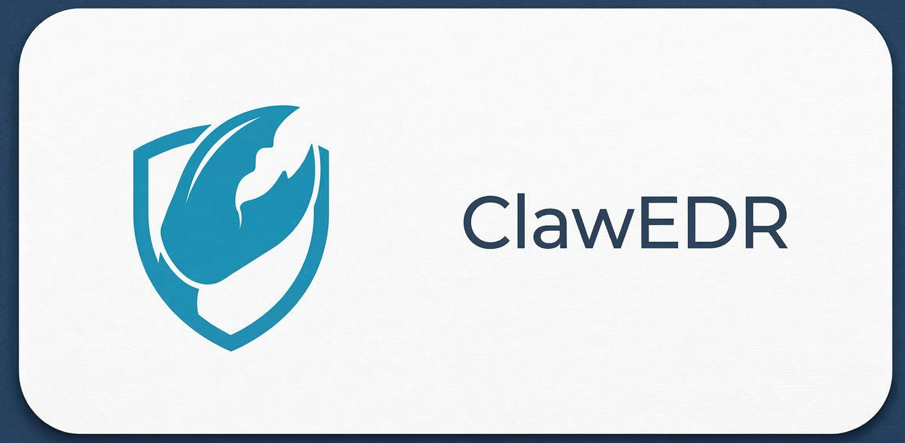

<p align="center">
  
</p>

[](https://www.python.org/)
[](https://ebpf.io/)
[](https://developer.apple.com/library/archive/documentation/Security/Conceptual/AppSandboxDesignGuide/)

Kernel-level endpoint detection and response for OpenClaw. ClawEDR enforces security policies via **eBPF** (Linux) and **Apple Seatbelt** (macOS) so that compromised or malicious tool-use never reaches sensitive files, networks, or processes.

## Install

```sh
curl -fsSL https://raw.githubusercontent.com/leos565/clawedr/main/deploy/install.sh | sudo sh
```

Then restart your agent. ClawEDR runs as a background daemon — no wrapper needed on Linux, transparent `sandbox-exec` wrapper on macOS.

## How It Works

```
master_rules.yaml + ClawSec threat feed
        ↓  (compiler.py)
compiled_policy.json + clawedr.sb
        ↓  (install.sh)
Shield daemon (eBPF / Seatbelt)
        ↓
Alerts → Dashboard (localhost:8477)
```

**Linux:** eBPF hooks on `execve`, `openat`, and `socket_connect` intercept system calls in-kernel. Blocked binaries receive `SIGKILL` before execution. Only OpenClaw processes and their descendants are monitored — the rest of the system is unaffected.

**macOS:** Apple Seatbelt sandbox profiles deny access to sensitive paths and executables at the kernel level. Violation logs are tailed and dispatched as alerts.

**Dashboard:** Web UI on port 8477 for viewing alerts, managing rule exemptions, and adding custom blocking rules. Auto-installed as a system service.

## Protection Modules

Beyond core policy enforcement, ClawEDR includes four additional protection layers:

| Module | Rule Prefix | What It Does |
|--------|-------------|--------------|
| **Output Scanner** | `OUT-*` | Scans agent stdout via eBPF tracepoint for secrets and PII (AWS keys, GitHub tokens, credit cards, SSNs, private keys, and more) before they reach the user |
| **Prompt Injection Detection** | `INJ-*` | Inspects content flowing into the agent for instruction-override, persona-hijack, steganography, and data-exfiltration patterns |
| **Egress Allowlist** | — | Restricts outbound network connections to an explicit domain allowlist enforced at the eBPF socket layer |
| **Cognitive Integrity Monitor** | `INT-*` | Tracks SHA-256 baselines of OpenClaw config files and alerts on unexpected modifications |

All modules are configurable from the dashboard and can be enabled/disabled independently.

## Rule System

Every rule has a stable ID for traceability and user overrides:

| Prefix | Category | Example |
|--------|----------|---------|
| `BIN-*` | Blocked executables | `BIN-001` → `nc` |
| `DOM-*` | Blocked domains | `DOM-016` → `pastebin.com` |
| `PATH-LIN-*` / `PATH-MAC-*` | Blocked paths | `PATH-LIN-002` → `/etc/shadow` |
| `LIN-*` / `MAC-*` | OS-specific deny rules | `LIN-050` → `dd` disk writes |
| `HEU-*` | Heuristic detections | `HEU-NET-001` → DNS exfil pattern |
| `THRT-*` | Threat feed entries | Auto-generated from ClawSec feed |
| `USR-*` | User custom rules | `USR-DOM-001` → `evil.com` |
| `OUT-*` | Output scanner patterns | `OUT-001` → AWS Access Key ID |
| `INJ-*` | Injection detection patterns | `INJ-006` → Zero-width unicode steganography |

## User Customization

All overrides live in `~/.clawedr/user_rules.yaml` and survive system updates:

```yaml
exempted_rule_ids:
  - "BIN-001"      # Allow nc

custom_rules:
  - id: USR-DOM-001
    type: domain
    value: evil.com
  - id: USR-PATH-001
    type: path
    value: /var/secrets
    platform: linux

# Module settings
output_scanner_enabled: true
injection_detection_enabled: true
egress_mode: allowlist
allowed_domains:
  - api.openai.com
  - api.anthropic.com
integrity_monitor_enabled: true
```

Supported custom rule types: `executable`, `domain`, `hash`, `path`, `argument`. Rules can also be managed from the dashboard UI.

## Dashboard

The web UI at `localhost:8477` provides:

- **Alerts** — filterable by time, severity, and module (Policy Rules / Threat Feed / Heuristics / Output Scanner / Prompt Injection / Custom). Per-alert dismiss and bulk clear.
- **Policy Rules** — toggle enforcement mode per rule, configure the security profile (Hobbyist → Professional → Military slider), add custom rules.
- **Output Scanner** — enable/disable categories, view pattern library with technical examples, inspect recent findings.
- **Prompt Injection** — configure injection detection categories, view triggered patterns.
- **Egress Control** — manage the outbound domain allowlist, switch between allowlist and monitor-only mode.
- **Integrity** — baseline management, per-file status, tamper alerts.
- **Settings** — API token, bind address, notification settings.

## Development

```sh
python3 -m venv .venv && source .venv/bin/activate
pip install -r requirements-dev.txt

./main.py sync      # Fetch threat feed + merge with master_rules.yaml
./main.py compile   # Generate compiled_policy.json + clawedr.sb
./main.py test      # Run pytest suite
./main.py publish   # Commit and push deploy/
./main.py all       # sync → compile → test
```

Linux eBPF tests require an OrbStack Ubuntu VM — configure the host in `builder/config.yaml`.

## Documentation

See [ARCHITECTURE.md](ARCHITECTURE.md) for detailed technical documentation including:

- Full project layout and component breakdown
- Shield enforcement details (eBPF hooks, Seatbelt profiles, process tracking)
- Threat intelligence pipeline
- Dashboard API reference
- Testing matrix and CI configuration
- Service management commands

## License

MIT
